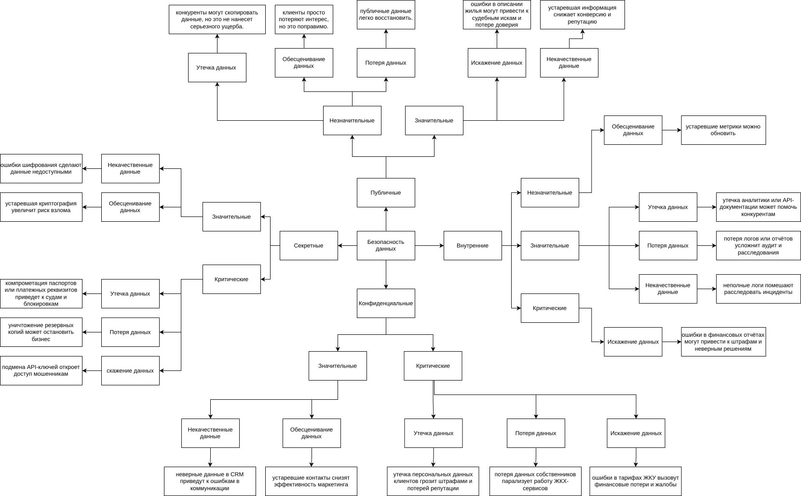

## Mindmap классификации данных:
[drawio xml файл](mindmap_PropDevelopment.drawio.xml)

то же самое в виде картинки:

## Классификация по стандартам ISO/IEC 27001 и 27002

### Публичные данные (Public Data)

Данные, которые могут быть открыто доступны без ограничений.

- Онлайн-витрина недвижимости (цена, площадь, планировка, локация).
- Онлайн-тур (фото, видео, 3D-модели жилья).
- Общая информация о жилых комплексах (описание, инфраструктура).
- Агрегированная аналитика рынка (без персональных данных).

### Внутренние данные (Internal Data)

Данные, доступные только сотрудникам и партнёрам, не подлежащие публикации.

- Данные о бронированиях (без персональных данных клиента).
- Финансовая отчётность компании (не публичная бухгалтерия).
- Внутренние BI-отчёты (анализ продаж, эффективности рекламы).
- Технические логи (доступы, ошибки, но без персональных данных).
- Документация API (для внутреннего использования).

### Конфиденциальные данные (Confidential Data)

Данные, требующие защиты из-за риска ущерба при утечке.

- Персональные данные клиентов (ФИО, телефон, email).
- Данные собственников (платежи ЖКУ, история ремонта).
- Данные сделок (договоры, условия оплаты).
- Данные "Умного дома" (настройки, логи доступа).
- Интеграции с госорганами (регистрационные данные).
- Данные управляющих компаний (тарифы, состояние домов).

### Секретные данные (Secret / Highly Confidential Data)

Критически важные данные, утечка которых нанесёт серьёзный ущерб.

- Паспортные данные и финансовые документы клиентов (используемые в сделках).
- Кредитные истории и платежные реквизиты.
- Ключи API и токены доступа к партнёрским системам.
- Резервные копии БД с персональными данными.
- Системные пароли и криптографические ключи.

## Риски для каждой категории данных

### 1. Публичные данные

Незначительные:

- Утечка данных - конкуренты могут скопировать данные, но это не нанесет серьезного ущерба.
- Обесценивание данных - клиенты просто потеряют интерес, но это поправимо.
- Потеря данных - публичные данные легко восстановить.

Значительные:

- Искажение данных - ошибки в описании жилья могут привести к судебным искам и потере доверия.
- Некачественные данные - устаревшая информация снижает конверсию и репутацию.

### 2. Внутренние данные

Незначительные:

- Обесценивание данных - устаревшие метрики можно обновить.

Значительные:

- Утечка данных - утечка аналитики или API-документации может помочь конкурентам.
- Потеря данных - потеря логов или отчётов усложнит аудит и расследования.
- Некачественные данные - неполные логи помешают расследовать инциденты.

Критические:

- Искажение данных - ошибки в финансовых отчётах могут привести к штрафам и неверным решениям.

### 3. Конфиденциальные данные

Значительные:

- Некачественные данные - неверные данные в CRM приведут к ошибкам в коммуникации.
- Обесценивание данных - устаревшие контакты снизят эффективность маркетинга.

Критические:

- Утечка данных - утечка персональных данных клиентов грозит штрафами и потерей репутации.
- Потеря данных - потеря данных собственников парализует работу ЖКХ-сервисов.
- Искажение данных - ошибки в тарифах ЖКУ вызовут финансовые потери и жалобы.

### 4. Секретные данные

Значительные:

- Некачественные данные - ошибки шифрования сделают данные недоступными.
- Обесценивание данных - устаревшая криптография увеличит риск взлома.

Критические:

- Утечка данных - компрометация паспортов или платежных реквизитов приведет к судам и блокировкам.
- Потеря данных - уничтожение резервных копий может остановить бизнес.
- Искажение данных - подмена API-ключей откроет доступ мошенникам.
