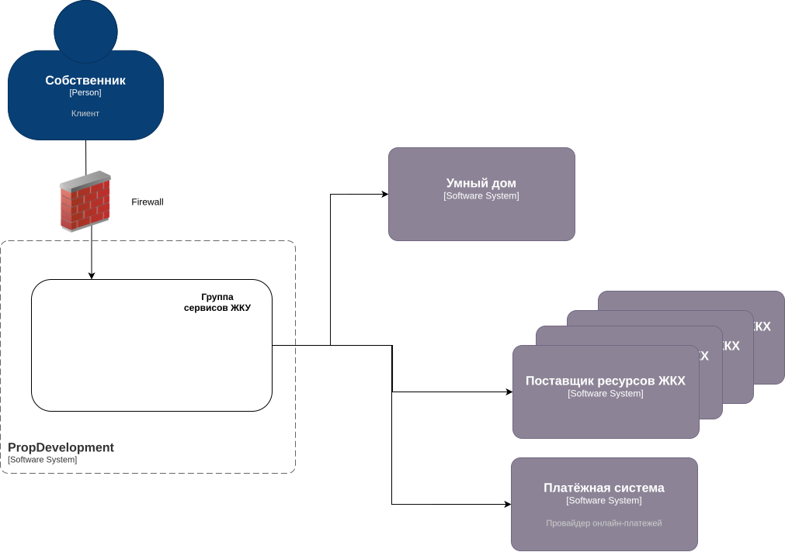

## Диаграмма контекста
[drawio xml файл](./PropDevelopment_С4_context.drawio.xml)

то же самое в виде картинки:

## Диаграмма контейнеров
[drawio xml файл](./PropDevelopment_С4_container.drawio.xml)

то же самое в виде картинки:

## Список требований
### Требования к безопасности
- Изоляция чувствительных компонентов
Видеопотоки, биометрия и номера авто не хранятся у PropDevelopment, только у партнёра. Прямой доступ к ним запрещён.

- У нас только метаинформация (время доступа, ID события).

### Шифрование
- Все каналы — TLS.

### Логирование и аудит
- Все события доступа (успешные/неуспешные) логируются.
- Должна быть возможность сверить действия с конкретным пользователем системы PropDevelopment.

### Минимизация данных
Только ID пользователя, разрешённый доступ, временные окна — никакой биометрии в нашем контуре.

### Fail-safe поведение
При потере связи — система работает локально у партнёра, мы не блокируем доступ жильцов. Используется кеш на стороне партнёра, кеш синхронизируется после восстановления связи.

## Аутентификация и авторизация
наша система выдаёт доступ внешнему сервису. Партнёрский сервис не авторизует сам — только проверяет токен, выпущенный нашей системой.
### OAuth 2.0 
для выдачи jwt access токена.
### OpenID Connect 
для передачи данных о жильце (его лицо, номер машины)

### JWT с коротким TTL + refresh
Каждый токен включает user_id, scopes (например: gate.open, camera.view).

### RBAC и ABAC
Права доступа по ролям: жильцы, администраторы, гости (по приглашению).

## Организация взаимодействия
Архитектура:
- PropDevelopment — центральная система (auth, разрешения, логи)
- Партнёр — исполнитель команды (видеопоток, открытие двери/шлагбаума)

### Протоколы взаимодействия:
- REST API 

Для синхронных команд (например, открыть дверь).

- WebSocket (если real-time)

Например, для живого видеопотока или отображения событий в приложении.

### Поток:

- Жилец открывает приложение - авторизация.
- Вызывает команду (например, "открыть шлагбаум").
- Наш backend валидирует - выдаёт токен → пересылает команду в сервис партнёра.
- Партнёр выполняет и отправляет webhook (rest api) о результате.
- Мы логируем событие, показываем в приложении.
